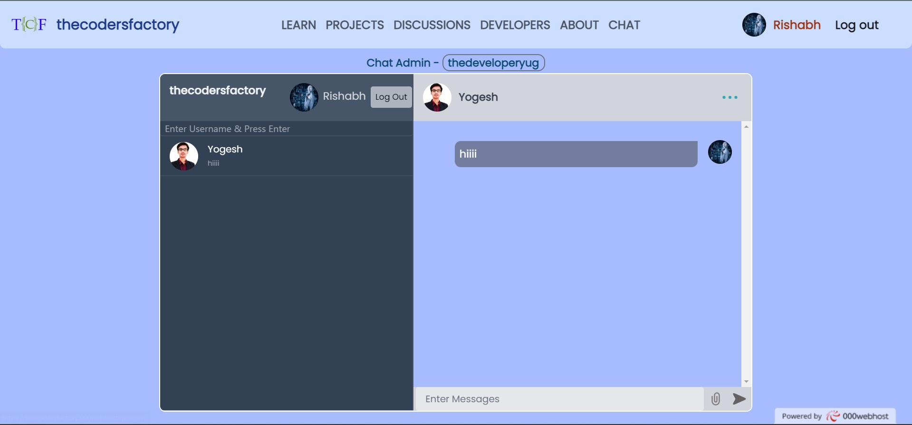

 The chat application we developed using React, Firebase, Docker, AWS ECS, AWS CodeDeploy, Git, and GitHub is a modern and scalable solution for real-time messaging and user authentication. The application allows users to create accounts, log in securely, and communicate with other users in real-time. It is containerized using Docker, making it easy to deploy and scale, and hosted on AWS ECS, providing scalability and reliability.

We used a DevOps approach for software development, which allowed us to integrate development and operations teams, automate the development process, and use modern technologies and tools. We used Git and GitHub for collaboration and code management, AWS CodePipeline and AWS CodeDeploy for automation, Firebase for real-time messaging and user authentication, and AWS CloudWatch for monitoring. The application was tested thoroughly, and the feedback loops were fast and effective.

The chat application we developed demonstrates the effectiveness of a DevOps approach for software development, including increased collaboration, faster feedback loops, improved quality, and timely delivery. We acknowledge the role of open-source software and libraries in enabling us to develop the application efficiently and effectively.

Moving forward, we plan to continue using a DevOps approach for software development, incorporating the latest technologies and best practices to deliver high-quality software efficiently and effectively. We hope that the chat application we developed will be useful for users and serve as a basis for future development and innovation in the field of real-time messaging and user authentication.

 

